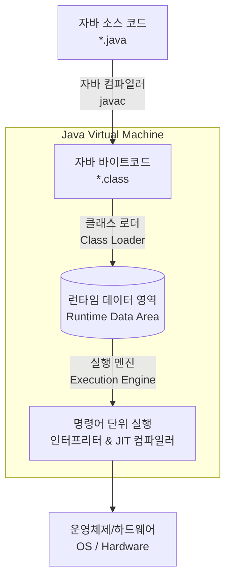

# 자바는 어떻게 실행될까? (Java 프로그램 실행 과정)

자바(Java) 프로그램이 실행되는 과정은 크게 소스 코드 작성, 컴파일, 그리고 JVM(Java Virtual Machine)을 통한 실행의 세 단계로 나뉜다. 자바는 "Write Once, Run Anywhere (한 번 작성하면 어디서든 실행된다)"는 특징을 가지며, 이를 가능하게 해주는 핵심이 바로 JVM이다.

---

## 1. 자바 프로그램의 전체 실행 과정 요약

1. 개발자가 자바 소스 코드(`*.java`)를 작성한다.
2. 자바 컴파일러(`javac`)가 소스 코드를 읽어 JVM이 이해할 수 있는 자바 바이트코드(`*.class`)로 컴파일한다.
3. 실행 시, JVM의 클래스 로더(Class Loader)가 이 바이트코드 파일들을 엮어서 JVM이 운영체제로부터 할당받은 메모리 공간(Runtime Data Area)에 동적으로 적재(Load)한다.
4. JVM의 실행 엔진(Execution Engine)이 메모리에 적재된 바이트코드를 기계어로 해석하고 운영체제를 통해 실행한다.

---

## 2. JVM의 주요 구성 요소와 역할 상세

자바 프로그램 실행의 주체인 JVM은 크게 클래스 로더, 실행 엔진, 가비지 컬렉터, 런타임 데이터 영역의 4가지 요소로 나눌 수 있다.

### 2.1. 클래스 로더 (Class Loader)
컴파일된 `.class` 파일들을 모아서 JVM의 메모리 영역인 Runtime Data Area로 적재하는 역할을 한다. 클래스 로더의 동작은 크게 세 단계로 이루어진다.
* Loading (적재): `.class` 파일을 읽어 바이트코드를 메모리의 메서드 영역(Method Area)에 저장한다.
* Linking (검증 및 준비): 코드가 자바 언어 명세에 맞는지 검증(Verify)하고, 정적 변수나 기본값들을 위해 메모리를 할당(Prepare)하며, 심볼릭 메모리 레퍼런스를 메모리 영역의 실제 레퍼런스로 교체(Resolve)한다.
* Initialization (초기화): 클래스 변수(static 변수)들을 적절한 값으로 초기화한다.

### 2.2. 실행 엔진 (Execution Engine)
클래스 로더에 의해 메모리에 적재된 바이트코드를 컴퓨터(운영체제)가 이해할 수 있는 기계어로 변경해 명령어 단위로 실행한다. 다음 두 가지 방식을 혼합하여 사용한다.

* 인터프리터 (Interpreter): 바이트코드를 한 줄씩 읽어서 기계어로 번역하고 바로 실행한다. 한 줄씩 빠르게 해석할 수 있으나 프로그램 전체의 실행 속도 자체는 다소 느리다는 단점이 있다.
* JIT 컴파일러 (Just-In-Time Compiler): 인터프리터 방식의 단점을 보완하기 위해 도입되었다. 인터프리터 방식으로 실행하다가 적절한 시점에 전체 바이트코드를 컴파일하여 네이티브 코드로 변경하고, 이후에는 캐싱된 네이티브 코드를 직접 실행한다. 자주 반복되는 코드(Hot Spot)에 대해 성능을 극대화한다.

### 2.3. 가비지 컬렉터 (Garbage Collector, GC)
Heap 메모리 영역에 생성된 객체들 중 더 이상 참조되지 않는(사용되지 않는) 객체들을 백그라운드에서 주기적으로 탐색 후 제거하여 메모리를 자동으로 관리한다. 이로 인해 개발자는 C/C++처럼 명시적으로 메모리를 해제(`free()`, `delete` 등)할 필요가 없다.

### 2.4. 런타임 데이터 영역 (Runtime Data Area)
JVM이 자바 프로그램을 실행하기 위해 운영체제로부터 할당받는 메모리 공간이다. 크게 5가지 영역으로 나뉜다.

* 모든 스레드가 공유하는 영역
  * Method Area (메서드 영역): 로드된 클래스 정보, Method 정보, static 변수, 그리고 런타임 상수표(Runtime Constant Pool) 등이 저장되는 영역이다.
  * Heap Area (힙 영역): `new` 키워드로 생성된 인스턴스(객체)와 배열이 동적으로 할당되는 영역이다. GC(가비지 컬렉터)의 주요 관리 대상이 된다.
* 각 스레드마다 개별적으로 생성되는 영역
  * Stack Area (스택 영역): 메서드 호출 시마다 스택 프레임(Stack Frame)이 생성되며, 메서드 내의 지역 변수, 매개 변수, 리턴 값 등이 저장된다. 메서드 실행이 끝나면 프레임 단위로 소멸된다.
  * PC Register (PC 레지스터): 현재 스레드가 실행 중인 JVM 명령(Instruction)의 주소값을 가리킨다.
  * Native Method Stack: 자바 외의 다른 언어(C, C++ 등)로 작성된 네이티브 코드를 실행하기 위한 공간이다.

---

## 3. 핵심 요약
* 자바 컴파일러는 플랫폼 독립적인 바이트코드(`.class`)를 생성한다.
* JVM은 이 바이트코드를 OS에 맞는 기계어로 번역하여 실행하므로, 프로그램은 OS에 종속되지 않고 어디서든 실행 가능하다.
* JIT 컴파일러의 캐싱과 컴파일 기법, 그리고 가비지 컬렉터(GC)의 자동 메모리 관리 덕분에 자바는 안정적인 성능과 높은 개발 편의성을 제공한다.

---

## 4. 추천 학습 자료 및 사이트

* [tistory - JDK / JRE / JVM 개념 & 구성 원리 💯 총정리]
  (https://inpa.tistory.com/entry/JAVA-%E2%98%95-JDK-JRE-JVM-%EA%B0%9C%EB%85%90-%EA%B5%AC%EC%84%B1-%EC%9B%90%EB%A6%AC-%F0%9F%92%AF-%EC%99%84%EB%B2%BD-%EC%B4%9D%EC%A0%95%EB%A6%AC)

